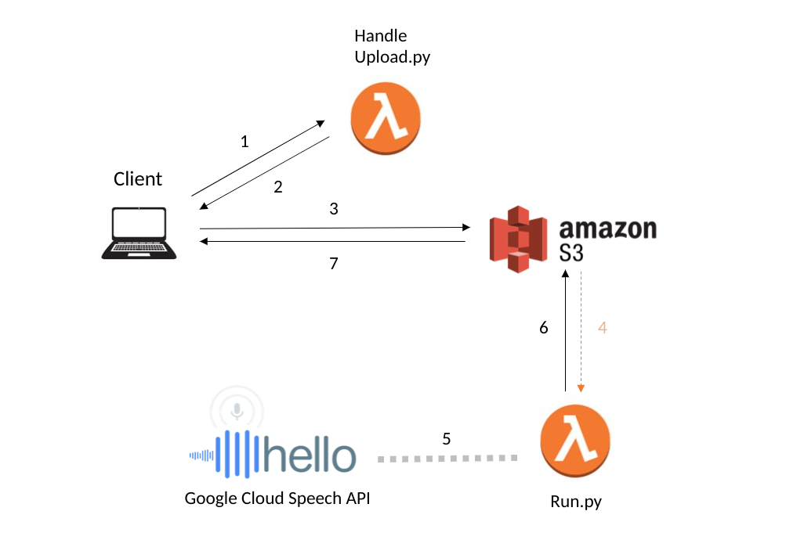

# Serverless-cloud-transcription

Using cloud computing services, many processes that traditionally require a server can be done using Pay-as-you-go solutions like AWS.

This is a proof-of-concept prototype to demonstrate how audio transcription service is possible on the cloud, without use of any static server.  
Although this implementation relies heavily on AWS cloud computing services, but using other cloud computing tools, like Google Firebase, is also possible. AWS S3 is used for hosting, lambda functions for file uploading, processing and transcription, as well as Dynamo for file logging.
  
[**Try the Demo**](http://test-serverless-victor.s3-website-us-east-1.amazonaws.com/demo/)  

# How it works

  
1. Request upload permission to S3
2. Lambda function returns temporary credentials
3. Upload media file to S3 Bucket
4. Upload triggers a lambda function, run.py
5. Extracts audio binary and connects to Google Cloud
6. Writes result to S3 bucket
7. Data transmitted back to Client browser
  
In my experiment, all of the above can be done within 3 seconds, if the audio clip is short and the internet connection is quick.
  
# Acknowledgement
1. Audio processing is done by ffmpeg, an open-source media conversion library
2. Exodus-bundler (https://github.com/intoli/exodus)
